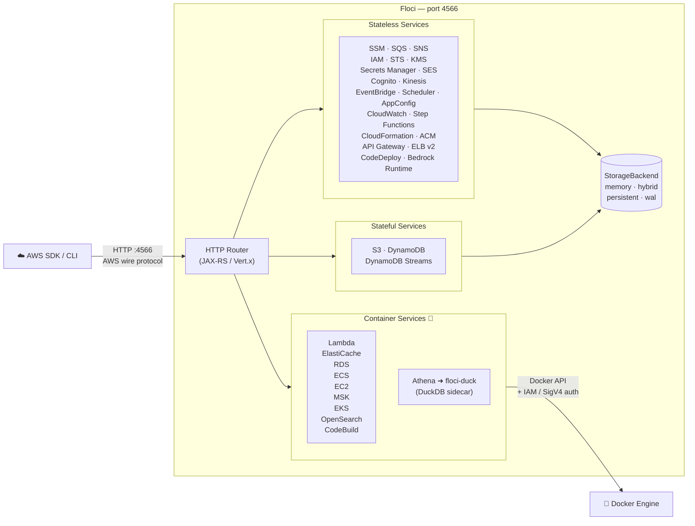

<p align="center">
  
</p>

<p align="center">
  <a href="https://github.com/floci-io/floci/releases/latest"></a>
  <a href="https://github.com/floci-io/floci/actions/workflows/release.yml"></a>
  <a href="https://hub.docker.com/r/hectorvent/floci"></a>
  <a href="https://hub.docker.com/r/hectorvent/floci"></a>
  <a href="https://opensource.org/licenses/MIT"></a>
  <a href="https://github.com/floci-io/floci/stargazers"></a>
  <a href="https://github.com/floci-io/floci/graphs/contributors"></a>
  <a href="https://join.slack.com/t/floci/shared_invite/zt-3tjn02s3q-A00kEjJ1cZxsg_imTfy6Cw"></a>

</p>

<p align="center">
  <em>Named after <a href="https://en.wikipedia.org/wiki/Cirrocumulus_floccus">floccus</a> — the cloud formation that looks exactly like popcorn.</em>
</p>

<p align="center">
  A free, open-source local AWS emulator. No account. No feature gates. Just&nbsp;<code>docker compose up</code>.
</p>

<p align="center">
  Join the community on <a href="https://join.slack.com/t/floci/shared_invite/zt-3tjn02s3q-A00kEjJ1cZxsg_imTfy6Cw">Slack</a> to ask questions, share feedback, and discuss Floci with other contributors and users. You can also open any topic in <a href="https://github.com/orgs/floci-io/discussions">GitHub Discussions</a> — feature ideas, compatibility questions, design tradeoffs, wild proposals, or half-baked thoughts are all welcome. No idea is too small, too early, or too popcorn-fueled to start a good discussion.
</p>

---

> [!IMPORTANT]
> **Image moved to `floci/floci`.** Update your `docker-compose.yml` and `docker run` commands:
> ```
> # Before
> image: hectorvent/floci:latest
> # After
> image: floci/floci:latest
> ```
> The old `hectorvent/floci` repository will no longer receive updates.

---

> LocalStack's community edition [sunset in March 2026](https://blog.localstack.cloud/the-road-ahead-for-localstack/) — requiring auth tokens, and freezing security updates. Floci is the no-strings-attached alternative.

## Why Floci?

| | Floci | LocalStack Community |
|---|---|---|
| Auth token required | No | Yes (since March 2026) |
| Security updates | Yes | Frozen |
| Startup time | **~24 ms** | ~3.3 s |
| Idle memory | **~13 MiB** | ~143 MiB |
| Docker image size | **~90 MB** | ~1.0 GB |
| License | **MIT** | Restricted |
| API Gateway v2 / HTTP API | ✅ | ❌ |
| Cognito | ✅ | ❌ |
| ElastiCache (Redis + IAM auth) | ✅ | ❌ |
| RDS (PostgreSQL + MySQL + IAM auth) | ✅ | ❌ |
| MSK (Kafka + Redpanda) | ✅ | ❌ |
| Athena (real SQL via DuckDB sidecar + Glue views) | ✅ | ❌ |
| Glue Data Catalog | ✅ | ❌ |
| Data Firehose (NDJSON delivery) | ✅ | ❌ |
| S3 Object Lock (COMPLIANCE / GOVERNANCE) | ✅ | ⚠️ Partial |
| DynamoDB Streams | ✅ | ⚠️ Partial |
| IAM (users, roles, policies, groups) | ✅ | ⚠️ Partial |
| STS (all 7 operations) | ✅ | ⚠️ Partial |
| Kinesis (streams, shards, fan-out) | ✅ | ⚠️ Partial |
| KMS (sign, verify, re-encrypt) | ✅ | ⚠️ Partial |
| ECS (clusters, services, tasks) | ✅ | ❌ |
| EKS (clusters, mock + real k3s) | ✅ | ❌ |
| EC2 (real Docker instances, IMDS, SSH, UserData) | ✅ | ❌ |
| CodeBuild (real Docker build execution, S3 artifacts, CloudWatch logs) | ✅ | ❌ |
| CodeDeploy (Lambda traffic shifting, lifecycle hooks, auto-rollback) | ✅ | ❌ |
| Native binary | ✅ ~40 MB | ❌ |

**Broad AWS coverage. Free forever.**

## Architecture Overview



## Real Docker Integration

Unlike mock-only emulators, Floci runs **real Docker containers** for services where in-process emulation would compromise fidelity — stateful databases, connection-heavy protocols, and runtimes that require native execution. The result is wire-compatible behavior against the actual engine, not a simplified approximation.

| Service | Default Docker image | What's real |
|---|---|---|
| **Lambda** | `public.ecr.aws/lambda/<runtime>` | AWS runtime environment, execution model, warm container pool |
| **ElastiCache** | `valkey/valkey:8` | Full Redis/Valkey protocol, ACL-based IAM auth, SigV4 validation |
| **RDS (PostgreSQL)** | `postgres:16-alpine` | Real PostgreSQL engine, IAM auth via token, JDBC-compatible |
| **RDS (MySQL / Aurora)** | `mysql:8.0` | Real MySQL engine, IAM auth, JDBC-compatible |
| **RDS (MariaDB)** | `mariadb:11` | Real MariaDB engine, IAM auth, JDBC-compatible |
| **MSK** | `redpandadata/redpanda:latest` | Real Kafka-compatible broker via Redpanda |
| **EC2** | AMI-mapped (e.g. `public.ecr.aws/amazonlinux/amazonlinux:2023`) | Real Linux containers; SSH key injection; UserData execution; IMDS with IMDSv1+IMDSv2 and IAM credential serving |
| **ECS** | User-specified in task definition | Actual container lifecycle — start, stop, health checks |
| **EKS** | `rancher/k3s:latest` | Live Kubernetes API server (k3s), full kubeconfig |
| **CodeBuild** | User-specified environment image (e.g. `public.ecr.aws/codebuild/amazonlinux2-x86_64-standard:5.0`) | Real buildspec execution — install/pre_build/build/post_build phases in container; S3 artifact upload; CloudWatch log streaming |
| **OpenSearch** | `opensearchproject/opensearch:2` | Full OpenSearch engine with REST API |
| **ECR** | `registry:2` | Real OCI-compatible registry — `docker push` / `docker pull` work natively |

### Lambda runtimes

Floci resolves each Lambda runtime to the corresponding [AWS public ECR image](https://gallery.ecr.aws/lambda):

| Runtime | Image |
|---|---|
| `java25` · `java21` · `java17` · `java11` · `java8.al2` · `java8` | `public.ecr.aws/lambda/java:<version>` |
| `python3.14` · `python3.13` · `python3.12` · `python3.11` · `python3.10` · `python3.9` | `public.ecr.aws/lambda/python:<version>` |
| `nodejs24.x` · `nodejs22.x` · `nodejs20.x` · `nodejs18.x` · `nodejs16.x` | `public.ecr.aws/lambda/nodejs:<version>` |
| `ruby3.4` · `ruby3.3` · `ruby3.2` | `public.ecr.aws/lambda/ruby:<version>` |
| `dotnet10` · `dotnet9` · `dotnet8` · `dotnet6` | `public.ecr.aws/lambda/dotnet:<version>` |
| `go1.x` | `public.ecr.aws/lambda/go:1` |
| `provided.al2023` · `provided.al2` · `provided` | `public.ecr.aws/lambda/provided:<variant>` |

Container image functions (package type `Image`) pass the `ImageUri` through directly, with ECR repository URIs rewritten to the local Floci ECR endpoint automatically.

### Requirements

Docker-backed services require the Docker socket to be accessible:

```bash
docker run -d --name floci \
  -p 4566:4566 \
  -v /var/run/docker.sock:/var/run/docker.sock \
  -u root \
  floci/floci:latest
```

In Docker Compose, add the socket volume alongside any other mounts.

### Overriding default images

All default images are configurable via environment variables, useful for pinning versions or using a local mirror:

| Variable | Default |
|---|---|
| `FLOCI_SERVICES_ELASTICACHE_DEFAULT_IMAGE` | `valkey/valkey:8` |
| `FLOCI_SERVICES_RDS_DEFAULT_POSTGRES_IMAGE` | `postgres:16-alpine` |
| `FLOCI_SERVICES_RDS_DEFAULT_MYSQL_IMAGE` | `mysql:8.0` |
| `FLOCI_SERVICES_RDS_DEFAULT_MARIADB_IMAGE` | `mariadb:11` |
| `FLOCI_SERVICES_MSK_DEFAULT_IMAGE` | `redpandadata/redpanda:latest` |
| `FLOCI_SERVICES_OPENSEARCH_DEFAULT_IMAGE` | `opensearchproject/opensearch:2` |
| `FLOCI_SERVICES_EKS_DEFAULT_IMAGE` | `rancher/k3s:latest` |
| `FLOCI_SERVICES_ECR_REGISTRY_IMAGE` | `registry:2` |
| `FLOCI_ECR_BASE_URI` | `public.ecr.aws` (Lambda runtime base) |

## Supported Services

| Service | How it works | Notable features |
|---|---|---|
| **SSM Parameter Store** | In-process | Version history, labels, SecureString, tagging |
| **SQS** | In-process | Standard & FIFO, DLQ, visibility timeout, batch, tagging |
| **SNS** | In-process | Topics, subscriptions, SQS / Lambda / HTTP delivery, tagging |
| **S3** | In-process | Versioning, multipart upload, pre-signed URLs, Object Lock, event notifications |
| **DynamoDB** | In-process | GSI / LSI, Query, Scan, TTL, transactions, batch operations |
| **DynamoDB Streams** | In-process | Shard iterators, records, Lambda ESM trigger |
| **Lambda** | **Real Docker containers** | Warm pool, aliases, Function URLs, SQS / Kinesis / DDB Streams ESM |
| **API Gateway REST** | In-process | Resources, methods, stages, Lambda proxy, MOCK integrations, AWS integrations |
| **API Gateway v2 (HTTP)** | In-process | Routes, integrations, JWT authorizers, stages |
| **IAM** | In-process | Users, roles, groups, policies, instance profiles, access keys |
| **STS** | In-process | AssumeRole, WebIdentity, SAML, GetFederationToken, GetSessionToken |
| **Cognito** | In-process | User pools, app clients, auth flows, JWKS / OpenID well-known endpoints |
| **KMS** | In-process | Encrypt / decrypt, sign / verify, data keys, aliases |
| **Kinesis** | In-process | Streams, shards, enhanced fan-out, split / merge |
| **Secrets Manager** | In-process | Versioning, resource policies, tagging |
| **Step Functions** | In-process | ASL execution, task tokens, execution history |
| **CloudFormation** | In-process | Stacks, change sets, resource provisioning |
| **EventBridge** | In-process | Custom buses, rules, targets (SQS / SNS / Lambda) |
| **EventBridge Scheduler** | In-process | Schedule groups, schedules, flexible time windows, retry policies, dead-letter queues |
| **CloudWatch Logs** | In-process | Log groups, streams, ingestion, filtering |
| **CloudWatch Metrics** | In-process | Custom metrics, statistics, alarms |
| **ElastiCache** | **Real Docker containers** | Redis / Valkey, IAM auth, SigV4 validation |
| **RDS** | **Real Docker containers** | PostgreSQL & MySQL, IAM auth, JDBC-compatible |
| **MSK** | **Real Docker containers** | Kafka compatible via Redpanda orchestration |
| **Athena** | In-process + **DuckDB sidecar** | Real SQL execution; Glue-backed views over S3 data; `read_parquet` / `read_json_auto` / `read_csv_auto` inferred from SerDe |
| **Glue** | In-process | Data Catalog; tables consumed by Athena as DuckDB views at query time |
| **Data Firehose** | In-process | Streaming data delivery; records flushed as NDJSON to S3 |
| **ECS** | **Real Docker containers** | Clusters, task definitions, tasks, services, capacity providers, task sets |
| **EC2** | **Real Docker containers** | `RunInstances` launches real Docker containers; SSH key injection; UserData execution; IMDS (IMDSv1+IMDSv2, port 9169) with IAM credential serving; VPCs, subnets, security groups, AMIs, key pairs, internet gateways, route tables, Elastic IPs, tags |
| **ACM** | In-process | Certificate issuance, validation lifecycle |
| **ECR** | In-process + **real OCI registry** | Repositories, image push / pull via stock `docker`, image-backed Lambda functions |
| **SES** | In-process | Send email / raw email, identity verification, DKIM attributes, email templates with `{{var}}` substitution |
| **SES v2 (HTTP)** | In-process | REST JSON API, identities, DKIM, feedback attributes, account sending, email templates with `{{var}}` substitution |
| **OpenSearch** | **Real Docker containers** | Domain CRUD, tags, versions, instance types, upgrade stubs |
| **AppConfig** | In-process | Applications, environments, profiles, hosted configuration versions, deployments |
| **AppConfigData** | In-process | Configuration sessions, dynamic configuration retrieval |
| **Bedrock Runtime** | In-process (stub) | Dummy Converse and InvokeModel responses for local development; streaming returns 501 |
| **EKS** | **Real Docker containers** (mock mode available) | Clusters, tagging; real mode starts k3s per cluster with a live Kubernetes API server |
| **ELB v2** | In-process | Application and Network Load Balancers, target groups, listeners, path/host-based routing rules, tags |
| **CodeBuild** | In-process + **real Docker containers** | Projects, report groups, source credentials; `StartBuild` runs real Docker containers, streams logs to CloudWatch, uploads artifacts to S3 via `docker cp` (works in Docker-in-Docker) |
| **CodeDeploy** | In-process + **Lambda traffic shifting** | Applications, deployment groups, deployment configs; 17 `CodeDeployDefault.*` built-ins pre-seeded; `CreateDeployment` shifts Lambda alias `RoutingConfig` weights, invokes lifecycle hooks, auto-rolls back on failure |

> **Lambda, ElastiCache, RDS, MSK, ECS, EC2, EKS, OpenSearch, and CodeBuild** spin up real Docker containers and support IAM authentication and SigV4 request signing — the same auth flow as production AWS. **ECR** runs a shared `registry:2` container so the stock `docker` client can push and pull image bytes against repositories returned by the AWS-shaped control plane.
>
> For per-service operation counts and endpoint protocols, see the [Services Overview](https://floci.io/floci/services/) in the documentation site.

**41 AWS services supported.**

## Persistence & Storage Modes

Floci features a flexible storage architecture designed to balance developer productivity, performance, and data durability. You can configure the storage mode globally via `FLOCI_STORAGE_MODE` or override it for specific services.

| Mode | Behavior | Best for... | Durability |
|:---:|---|---|:---:|
| **`memory`** | **(Default)** Entirely in-RAM. Data is lost when the container stops. | Speed, ephemeral testing, CI pipelines. | ❌ None |
| **`persistent`** | Data is loaded at startup and flushed to disk on graceful shutdown. | Simple local dev with state preservation. | ⚠️ Medium |
| **`hybrid`** | In-memory performance with periodic async flushing (every 5s). | The perfect balance of speed and safety. | ✅ Good |
| **`wal`** | Write-Ahead Log. Every mutation is logged to disk before responding. | Maximum durability for critical state. | 💎 Highest |

> [!TIP]
> The default **`memory`** mode is ideal for fast, ephemeral CI pipelines where state doesn't need to survive restarts. Switch to **`hybrid`** for local development when you want state preserved across container restarts without sacrificing performance.

For more details, visit the [Storage Configuration documentation](https://floci.io/floci/configuration/storage/).

## Quick Start

```yaml
# docker-compose.yml
services:
  floci:
    image: floci/floci:latest
    ports:
      - "4566:4566"
    volumes:
      # Local directory bind mount (default)
      - ./data:/app/data
      
      # OR named volume (optional):
      # - floci-data:/app/data

#volumes:
#  floci-data:
```

```bash
docker compose up
```

Or run Floci directly with Docker:

```bash
docker run -d --name floci \
  -p 4566:4566 \
  -v /var/run/docker.sock:/var/run/docker.sock \
  -e FLOCI_DEFAULT_REGION=us-east-1 \
  -e FLOCI_SERVICES_LAMBDA_DOCKER_NETWORK=bridge \
  -u root \
  floci/floci:latest
```

All services are available at `http://localhost:4566`. Use any AWS region — credentials can be anything.

```bash
export AWS_ENDPOINT_URL=http://localhost:4566
export AWS_DEFAULT_REGION=us-east-1
export AWS_ACCESS_KEY_ID=test
export AWS_SECRET_ACCESS_KEY=test

# Try it
aws s3 mb s3://my-bucket
aws sqs create-queue --queue-name my-queue
aws dynamodb list-tables
```

## SDK Integration

Point your existing AWS SDK at `http://localhost:4566` — no other changes needed.

```java
// Java (AWS SDK v2)
var client = DynamoDbClient.builder()
    .endpointOverride(URI.create("http://localhost:4566"))
    .region(Region.US_EAST_1)
    .credentialsProvider(StaticCredentialsProvider.create(
        AwsBasicCredentials.create("test", "test")))
    .build();

client.createTable(b -> b
    .tableName("demo-table")
    .billingMode(BillingMode.PAY_PER_REQUEST)
    .attributeDefinitions(
        AttributeDefinition.builder().attributeName("pk").attributeType(ScalarAttributeType.S).build())
    .keySchema(
        KeySchemaElement.builder().attributeName("pk").keyType(KeyType.HASH).build()));

client.putItem(b -> b
    .tableName("demo-table")
    .item(Map.of("pk", AttributeValue.fromS("item-1"))));

System.out.println(client.listTables().tableNames());
```

```python
# Python (boto3)
import boto3
client = boto3.client("ssm",
    endpoint_url="http://localhost:4566",
    region_name="us-east-1",
    aws_access_key_id="test",
    aws_secret_access_key="test")

client.put_parameter(
    Name="/demo/app/message",
    Value="hello from floci",
    Type="String",
    Overwrite=True,
)

response = client.get_parameter(Name="/demo/app/message")
print(response["Parameter"]["Value"])
```

```javascript
// consumer.mjs
// Node.js (AWS SDK v3)
import {DeleteMessageCommand, ReceiveMessageCommand, SQSClient,} from "@aws-sdk/client-sqs";

const client = new SQSClient({
    endpoint: "http://localhost:4566",
    region: "us-east-1",
    credentials: {accessKeyId: "test", secretAccessKey: "test"},
});

const QUEUE_URL = "http://localhost:4566/000000000000/demo-queue";

const response = await client.send(
    new ReceiveMessageCommand({
        QueueUrl: QUEUE_URL,
        MaxNumberOfMessages: 1,
        WaitTimeSeconds: 5,
    }),
);

if (response.Messages) {
    for (const msg of response.Messages) {
        console.log("Message received:", msg.Body);

        await client.send(
            new DeleteMessageCommand({
                QueueUrl: QUEUE_URL,
                ReceiptHandle: msg.ReceiptHandle,
            }),
        );
    }
}

```
```javascript
// producer.mjs
// Node.js (AWS SDK v3)
import {SendMessageCommand, SQSClient} from "@aws-sdk/client-sqs";

const client = new SQSClient({
    endpoint: "http://localhost:4566",
    region: "us-east-1",
    credentials: {accessKeyId: "test", secretAccessKey: "test"},
});

const QUEUE_URL = "http://localhost:4566/000000000000/demo-queue";

await client.send(
    new SendMessageCommand({
        QueueUrl: QUEUE_URL,
        MessageBody: "hello from producer",
    }),
);

console.log("Message sent");

```

```go
// Go (AWS SDK v2)
package main

import (
	"context"
	"fmt"
	"log"
	"strings"

	"github.com/aws/aws-sdk-go-v2/aws"
	"github.com/aws/aws-sdk-go-v2/config"
	"github.com/aws/aws-sdk-go-v2/credentials"
	"github.com/aws/aws-sdk-go-v2/service/s3"
)

func main() {
	cfg, err := config.LoadDefaultConfig(context.TODO(),
		config.WithRegion("us-east-1"),
		config.WithCredentialsProvider(
			credentials.NewStaticCredentialsProvider("test", "test", ""),
		),
		config.WithBaseEndpoint("http://localhost:4566"),
	)
	if err != nil {
		log.Fatal(err)
	}

	client := s3.NewFromConfig(cfg, func(o *s3.Options) {
		o.UsePathStyle = true
	})

	_, err = client.CreateBucket(context.TODO(), &s3.CreateBucketInput{
		Bucket: aws.String("demo-bucket"),
	})
	if err != nil {
		log.Fatal(err)
	}

	_, err = client.PutObject(context.TODO(), &s3.PutObjectInput{
		Bucket: aws.String("demo-bucket"),
		Key:    aws.String("demo.txt"),
		Body:   strings.NewReader("hello from floci"),
	})
	if err != nil {
		log.Fatal(err)
	}

	out, err := client.ListObjectsV2(context.TODO(), &s3.ListObjectsV2Input{
		Bucket: aws.String("demo-bucket"),
	})
	if err != nil {
		log.Fatal(err)
	}

	if len(out.Contents) > 0 {
		fmt.Println(*out.Contents[0].Key)
	}
}

```

```rust
// Rust (AWS SDK)
use aws_sdk_secretsmanager::config::{Credentials, Region};
use aws_sdk_secretsmanager::Client;

#[tokio::main]
async fn main() -> Result<(), Box<dyn std::error::Error>> {
    let config = aws_config::defaults(aws_config::BehaviorVersion::latest())
        .region(Region::new("us-east-1"))
        .credentials_provider(Credentials::new("test", "test", None, None, "floci"))
        .endpoint_url("http://localhost:4566")
        .load()
        .await;

    let client = Client::new(&config);

    client
        .create_secret()
        .name("demo/secret")
        .secret_string("hello from floci")
        .send()
        .await?;

    let secret = client
        .get_secret_value()
        .secret_id("demo/secret")
        .send()
        .await?;

    println!("{}", secret.secret_string().unwrap());

    Ok(())
}
```

```bash
# Bash (AWS CLI)
export AWS_ACCESS_KEY_ID=test
export AWS_SECRET_ACCESS_KEY=test
export AWS_DEFAULT_REGION=us-east-1

tmp_file="$(mktemp)"
echo "hello from floci" > "$tmp_file"

aws --endpoint-url http://localhost:4566 s3 mb s3://my-bucket
aws --endpoint-url http://localhost:4566 s3 cp "$tmp_file" s3://my-bucket/demo.txt
aws --endpoint-url http://localhost:4566 s3 ls s3://my-bucket

# Cleanup
aws --endpoint-url http://localhost:4566 s3 rm s3://my-bucket/demo.txt
rm -f "$tmp_file"
```

## Testcontainers

Floci has first-class Testcontainers modules so you can start a real Floci instance from your tests with zero manual setup — no running daemon, no shared state, no port conflicts.

| Language | Package | Latest | Registry | Source |
|---|---|---|---|---|
| Java | `io.floci:testcontainers-floci` | `1.4.0` | [Maven Central](https://mvnrepository.com/artifact/io.floci/testcontainers-floci) | [GitHub](https://github.com/floci-io/testcontainers-floci) |
| Node.js | `@floci/testcontainers` | `0.1.0` | [npm](https://www.npmjs.com/package/@floci/testcontainers) | [GitHub](https://github.com/floci-io/testcontainers-floci-node) |
| Python | `testcontainers-floci` | `0.1.1` | [PyPI](https://pypi.org/project/testcontainers-floci/) | [GitHub](https://github.com/floci-io/testcontainers-floci-python) |
| Go | — | 🚧 In progress | — | [GitHub](https://github.com/floci-io/testcontainers-floci-go) |

### Java

Add the dependency (Testcontainers 1.x / Spring Boot 3.x):

```xml
<dependency>
    <groupId>io.floci</groupId>
    <artifactId>testcontainers-floci</artifactId>
    <version>1.4.0</version>
    <scope>test</scope>
</dependency>
```

For Testcontainers 2.x / Spring Boot 4.x use version `2.5.0`.

Basic usage with JUnit 5:

```java
@Testcontainers
class S3IntegrationTest {

    @Container
    static FlociContainer floci = new FlociContainer();

    @Test
    void shouldCreateBucket() {
        S3Client s3 = S3Client.builder()
                .endpointOverride(URI.create(floci.getEndpoint()))
                .region(Region.of(floci.getRegion()))
                .credentialsProvider(StaticCredentialsProvider.create(
                        AwsBasicCredentials.create(floci.getAccessKey(), floci.getSecretKey())))
                .forcePathStyle(true)
                .build();

        s3.createBucket(b -> b.bucket("my-bucket"));

        assertThat(s3.listBuckets().buckets())
                .anyMatch(b -> b.name().equals("my-bucket"));
    }
}
```

**Spring Boot** — add `spring-boot-testcontainers-floci` and use `@ServiceConnection` for zero-config auto-wiring:

```java
@SpringBootTest
@Testcontainers
class AppIntegrationTest {

    @Container
    @ServiceConnection
    static FlociContainer floci = new FlociContainer();

    @Autowired
    S3Client s3;

    @Test
    void shouldCreateBucket() {
        s3.createBucket(b -> b.bucket("my-bucket"));
        assertThat(s3.listBuckets().buckets())
                .anyMatch(b -> b.name().equals("my-bucket"));
    }
}
```

### Node.js / TypeScript

```sh
npm install --save-dev @floci/testcontainers
```

```ts
import { FlociContainer } from "@floci/testcontainers";
import { S3Client, CreateBucketCommand, ListBucketsCommand } from "@aws-sdk/client-s3";

describe("S3", () => {
    let floci: FlociContainer;

    beforeAll(async () => {
        floci = await new FlociContainer().start();
    });

    afterAll(async () => {
        await floci.stop();
    });

    it("should create and list a bucket", async () => {
        const s3 = new S3Client({
            endpoint: floci.getEndpoint(),
            region: floci.getRegion(),
            credentials: {
                accessKeyId: floci.getAccessKey(),
                secretAccessKey: floci.getSecretKey(),
            },
            forcePathStyle: true,
        });

        await s3.send(new CreateBucketCommand({ Bucket: "my-bucket" }));
        const { Buckets } = await s3.send(new ListBucketsCommand({}));
        expect(Buckets?.some(b => b.Name === "my-bucket")).toBe(true);
    });
});
```

### Python

```sh
pip install testcontainers-floci
```

```python
import boto3
from testcontainers_floci import FlociContainer

def test_s3_create_bucket():
    with FlociContainer() as floci:
        s3 = boto3.client(
            "s3",
            endpoint_url=floci.get_endpoint(),
            region_name=floci.get_region(),
            aws_access_key_id=floci.get_access_key(),
            aws_secret_access_key=floci.get_secret_key(),
        )

        s3.create_bucket(Bucket="my-bucket")
        buckets = s3.list_buckets()["Buckets"]
        assert any(b["Name"] == "my-bucket" for b in buckets)
```

Pytest fixture style:

```python
import pytest
import boto3
from testcontainers_floci import FlociContainer

@pytest.fixture(scope="session")
def floci():
    with FlociContainer() as container:
        yield container

def test_s3_create_bucket(floci):
    s3 = boto3.client(
        "s3",
        endpoint_url=floci.get_endpoint(),
        region_name=floci.get_region(),
        aws_access_key_id=floci.get_access_key(),
        aws_secret_access_key=floci.get_secret_key(),
    )
    s3.create_bucket(Bucket="my-bucket")
    buckets = s3.list_buckets()["Buckets"]
    assert any(b["Name"] == "my-bucket" for b in buckets)
```

### Go

Go support is in progress. Track it at [testcontainers-floci-go](https://github.com/floci-io/testcontainers-floci-go).

## Compatibility Testing

> For full compatibility validation against real SDK and client workflows, see the [compatibility-tests](./compatibility-tests/) directory.

This directory provides a dedicated compatibility test suite for Floci across multiple SDKs and tooling scenarios, and is the recommended starting point when verifying integration behavior end to end.

Available compatibility test modules:

| Module | Language / Tool | SDK / Client / Version | Tests |
|---|---|---|---:|
| `sdk-test-java` | Java 17 | AWS SDK for Java v2 | 889 |
| `sdk-test-node` | Node.js | AWS SDK for JavaScript v3 | 360 |
| `sdk-test-python` | Python 3 | boto3 | 264 |
| `sdk-test-go` | Go | AWS SDK for Go v2 | 136 |
| `sdk-test-awscli` | Bash | AWS CLI v2 | 145 |
| `sdk-test-rust` | Rust | AWS SDK for Rust | 86 |
| `compat-terraform` | Terraform | v1.10+ | 14 |
| `compat-opentofu` | OpenTofu | v1.9+ | 14 |
| `compat-cdk` | AWS CDK | v2+ | 17 |

**1,850+ automated compatibility tests across 6 SDKs and 3 IaC tools.**

## Image Tags

| Tag | Description |
|---|---|
| `latest` | Native image — sub-second startup **(recommended)** |
| `latest-jvm` | JVM image |
| `x.y.z` / `x.y.z-jvm` | Pinned releases |

## Configuration

All settings are overridable via environment variables (`FLOCI_` prefix).

| Variable | Default | Description                                                                         |
|---|---|-------------------------------------------------------------------------------------|
| `FLOCI_PORT` | `4566` | Port exposed by the Floci API                                                       |
| `FLOCI_DEFAULT_REGION` | `us-east-1` | Default AWS region                                                                  |
| `FLOCI_DEFAULT_ACCOUNT_ID` | `000000000000` | Default AWS account ID                                                              |
| `FLOCI_BASE_URL` | `http://localhost:4566` | Base URL used when Floci returns service URLs (e.g. SQS QueueUrl)                   |
| `FLOCI_HOSTNAME` | *(unset)* | Hostname to use in returned URLs when Floci runs inside Docker Compose              |
| `FLOCI_STORAGE_MODE` | `memory` | Controls how data is stored across runs: `memory` · `persistent` · `hybrid` · `wal` |
| `FLOCI_STORAGE_PERSISTENT_PATH` | `./data` | Directory used for persisted state                                                  |
| `FLOCI_ECR_BASE_URI` | `public.ecr.aws` | AWS ECR base URI used when pulling container images (e.g. Lambda)                   |

* Full reference: [configuration docs](https://floci.io/floci/configuration/application-yml/)
* Per-service storage overrides: [storage docs](https://floci.io/floci/configuration/storage/#per-service-storage-overrides)

**Multi-container Docker Compose:** When your application runs in a separate container from Floci, set `FLOCI_HOSTNAME` to the Floci service name so that returned URLs (e.g. SQS QueueUrl) resolve correctly:

```yaml
services:
  floci:
    image: floci/floci:latest
    ports:
      - "4566:4566"
    environment:
      - FLOCI_HOSTNAME=floci  # URLs will use http://floci:4566/...
  my-app:
    environment:
      - AWS_ENDPOINT_URL=http://floci:4566
    depends_on:
      - floci
```

Without this, SQS returns `http://localhost:4566/...` in QueueUrl responses, which resolves to the wrong container.

## Star history

[](https://star-history.com/#floci-io/floci&Date)

## Contributors

<a href="https://github.com/floci-io/floci/graphs/contributors">
  
</a>

## License

MIT — use it however you want.
