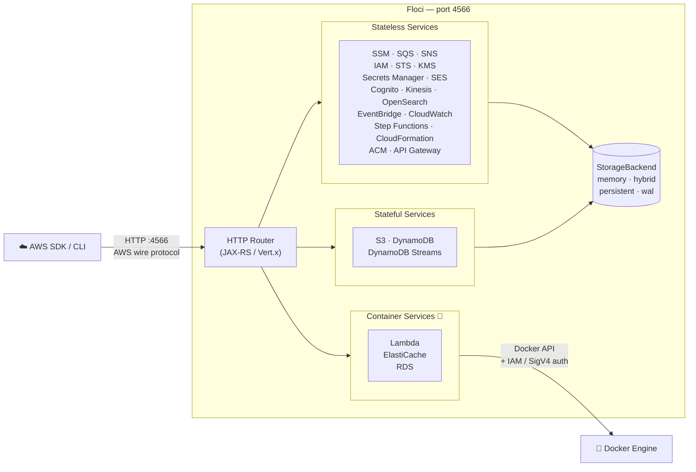

<p align="center">
  
</p>

<p align="center">
  <a href="https://github.com/hectorvent/floci/releases/latest"></a>
  <a href="https://github.com/hectorvent/floci/actions/workflows/release.yml"></a>
  <a href="https://hub.docker.com/r/hectorvent/floci"></a>
  <a href="https://hub.docker.com/r/hectorvent/floci"></a>
  <a href="https://opensource.org/licenses/MIT"></a>
  <a href="https://github.com/hectorvent/floci/stargazers"></a>
  <a href="https://github.com/hectorvent/floci/graphs/contributors"></a>
  <a href="https://join.slack.com/t/floci/shared_invite/zt-3tjn02s3q-A00kEjJ1cZxsg_imTfy6Cw"></a>

</p>

<p align="center">
  <em>Named after <a href="https://en.wikipedia.org/wiki/Cirrocumulus_floccus">floccus</a> — the cloud formation that looks exactly like popcorn.</em>
</p>

<p align="center">
  A free, open-source local AWS emulator. No account. No feature gates. Just&nbsp;<code>docker compose up</code>.
</p>

<p align="center">
  Join the community on <a href="https://join.slack.com/t/floci/shared_invite/zt-3tjn02s3q-A00kEjJ1cZxsg_imTfy6Cw">Slack</a> to ask questions, share feedback, and discuss Floci with other contributors and users. You can also open any topic in <a href="https://github.com/hectorvent/floci/discussions">GitHub Discussions</a> — feature ideas, compatibility questions, design tradeoffs, wild proposals, or half-baked thoughts are all welcome. No idea is too small, too early, or too popcorn-fueled to start a good discussion.
</p>

---

> LocalStack's community edition [sunset in March 2026](https://blog.localstack.cloud/the-road-ahead-for-localstack/) — requiring auth tokens, and freezing security updates. Floci is the no-strings-attached alternative.

## Why Floci?

| | Floci | LocalStack Community |
|---|---|---|
| Auth token required | No | Yes (since March 2026) |
| Security updates | Yes | Frozen |
| Startup time | **~24 ms** | ~3.3 s |
| Idle memory | **~13 MiB** | ~143 MiB |
| Docker image size | **~90 MB** | ~1.0 GB |
| License | **MIT** | Restricted |
| API Gateway v2 / HTTP API | ✅ | ❌ |
| Cognito | ✅ | ❌ |
| ElastiCache (Redis + IAM auth) | ✅ | ❌ |
| RDS (PostgreSQL + MySQL + IAM auth) | ✅ | ❌ |
| S3 Object Lock (COMPLIANCE / GOVERNANCE) | ✅ | ⚠️ Partial |
| DynamoDB Streams | ✅ | ⚠️ Partial |
| IAM (users, roles, policies, groups) | ✅ | ⚠️ Partial |
| STS (all 7 operations) | ✅ | ⚠️ Partial |
| Kinesis (streams, shards, fan-out) | ✅ | ⚠️ Partial |
| KMS (sign, verify, re-encrypt) | ✅ | ⚠️ Partial |
| Native binary | ✅ ~40 MB | ❌ |

**25 services. 408/408 SDK tests passing. Free forever.**

## Architecture Overview



## Supported Services

| Service | Ops | How it works | Notable features |
|---|---|---|---|
| **SSM Parameter Store** | 12 | In-process | Version history, labels, SecureString, tagging |
| **SQS** | 17 | In-process | Standard & FIFO, DLQ, visibility timeout, batch, tagging |
| **SNS** | 13 | In-process | Topics, subscriptions, SQS / Lambda / HTTP delivery, tagging |
| **S3** | 30 | In-process | Versioning, multipart upload, pre-signed URLs, Object Lock, event notifications |
| **DynamoDB** | 22 | In-process | GSI / LSI, Query, Scan, TTL, transactions, batch operations |
| **DynamoDB Streams** | 5 | In-process | Shard iterators, records, Lambda ESM trigger |
| **Lambda** | 25 | **Real Docker containers** | Warm pool, aliases, Function URLs, SQS / Kinesis / DDB Streams ESM |
| **API Gateway REST** | 24 | In-process | Resources, methods, stages, Lambda proxy, MOCK integrations, AWS integrations |
| **API Gateway v2 (HTTP)** | 16 | In-process | Routes, integrations, JWT authorizers, stages |
| **IAM** | 65+ | In-process | Users, roles, groups, policies, instance profiles, access keys |
| **STS** | 7 | In-process | AssumeRole, WebIdentity, SAML, GetFederationToken, GetSessionToken |
| **Cognito** | 20 | In-process | User pools, app clients, auth flows, JWKS / OpenID well-known endpoints |
| **KMS** | 15 | In-process | Encrypt / decrypt, sign / verify, data keys, aliases |
| **Kinesis** | 15 | In-process | Streams, shards, enhanced fan-out, split / merge |
| **Secrets Manager** | 10 | In-process | Versioning, resource policies, tagging |
| **Step Functions** | 11 | In-process | ASL execution, task tokens, execution history |
| **CloudFormation** | 12 | In-process | Stacks, change sets, resource provisioning |
| **EventBridge** | 14 | In-process | Custom buses, rules, targets (SQS / SNS / Lambda) |
| **CloudWatch Logs** | 14 | In-process | Log groups, streams, ingestion, filtering |
| **CloudWatch Metrics** | 5 | In-process | Custom metrics, statistics, alarms |
| **ElastiCache** | 9 | **Real Docker containers** | Redis / Valkey, IAM auth, SigV4 validation |
| **RDS** | 14 | **Real Docker containers** | PostgreSQL & MySQL, IAM auth, JDBC-compatible |
| **ACM** | 8 | In-process | Certificate issuance, validation lifecycle |
| **SES** | 14 | In-process | Send email / raw email, identity verification, DKIM attributes |
| **OpenSearch** | 24 | In-process | Domain CRUD, tags, versions, instance types, upgrade stubs |

> **Lambda, ElastiCache, and RDS** spin up real Docker containers and support IAM authentication and SigV4 request signing — the same auth flow as production AWS.

## Quick Start

```yaml
# docker-compose.yml
services:
  floci:
    image: hectorvent/floci:latest
    ports:
      - "4566:4566"
    volumes:
      # Local directory bind mount (default)
      - ./data:/app/data
      
      # OR named volume (optional):
      # - floci-data:/app/data

#volumes:
#  floci-data:
```

```bash
docker compose up
```

All services are available at `http://localhost:4566`. Use any AWS region — credentials can be anything.

```bash
export AWS_ENDPOINT_URL=http://localhost:4566
export AWS_DEFAULT_REGION=us-east-1
export AWS_ACCESS_KEY_ID=test
export AWS_SECRET_ACCESS_KEY=test

# Try it
aws s3 mb s3://my-bucket
aws sqs create-queue --queue-name my-queue
aws dynamodb list-tables
```

## SDK Integration

Point your existing AWS SDK at `http://localhost:4566` — no other changes needed.

```java
// Java (AWS SDK v2)
DynamoDbClient client = DynamoDbClient.builder()
    .endpointOverride(URI.create("http://localhost:4566"))
    .region(Region.US_EAST_1)
    .credentialsProvider(StaticCredentialsProvider.create(
        AwsBasicCredentials.create("test", "test")))
    .build();
```

```python
# Python (boto3)
import boto3
client = boto3.client("s3",
    endpoint_url="http://localhost:4566",
    region_name="us-east-1",
    aws_access_key_id="test",
    aws_secret_access_key="test")
```

```javascript
// Node.js (AWS SDK v3)
import { S3Client } from "@aws-sdk/client-s3";

const client = new S3Client({
    endpoint: "http://localhost:4566",
    region: "us-east-1",
    credentials: { accessKeyId: "test", secretAccessKey: "test" },
    forcePathStyle: true,
});
```

## Compatibility Testing

> For full compatibility validation against real SDK and client workflows, use [floci-compatibility-tests](https://github.com/hectorvent/floci-compatibility-tests).

This companion project provides a dedicated compatibility test suite for Floci across multiple SDKs and tooling scenarios, and is the recommended starting point when verifying integration behavior end to end.

Available SDK test modules:

| Module | Language / Tool | SDK / Client |
|---|---|---|
| `sdk-test-java` | Java 17 | AWS SDK for Java v2 |
| `sdk-test-go` | Go | AWS SDK for Go v2 |
| `sdk-test-node` | Node.js | AWS SDK for JavaScript v3 |
| `sdk-test-python` | Python 3 | boto3 |
| `sdk-test-rust` | Rust | AWS SDK for Rust |
| `sdk-test-awscli` | Bash | AWS CLI v2 |

The repository also includes compatibility validation for infrastructure tooling through `compat-cdk` (AWS CDK v2) and `compat-opentofu` (OpenTofu / Terraform-compatible workflows).

## Image Tags

| Tag | Description |
|---|---|
| `latest` | Native image — sub-second startup **(recommended)** |
| `latest-jvm` | JVM image — broadest platform compatibility |
| `x.y.z` / `x.y.z-jvm` | Pinned releases |

## Configuration

All settings are overridable via environment variables (`FLOCI_` prefix).

| Variable | Default | Description |
|---|---|---|
| `QUARKUS_HTTP_PORT` | `4566` | HTTP port |
| `FLOCI_DEFAULT_REGION` | `us-east-1` | Default AWS region |
| `FLOCI_DEFAULT_ACCOUNT_ID` | `000000000000` | Default AWS account ID |
| `FLOCI_BASE_URL` | `http://localhost:4566` | Base URL used in API responses (e.g. SQS QueueUrl) |
| `FLOCI_HOSTNAME` | *(unset)* | Override hostname in response URLs (for Docker Compose) |
| `FLOCI_STORAGE_MODE` | `memory` | `memory` · `persistent` · `hybrid` · `wal` |
| `FLOCI_STORAGE_PERSISTENT_PATH` | `./data` | Data directory |
| `FLOCI_ECR_BASE_URI` | `public.ecr.aws` | AWS ECR Base URI to pull container images (e.g. Lambda) |

→ Full reference: [configuration docs](https://hectorvent.dev/floci/configuration/application-yml/)
→ Per-service storage overrides: [storage docs](https://hectorvent.dev/floci/configuration/storage/#per-service-storage-overrides)

**Multi-container Docker Compose:** When your application runs in a separate container from Floci, set `FLOCI_HOSTNAME` to the Floci service name so that returned URLs (e.g. SQS QueueUrl) resolve correctly:

```yaml
services:
  floci:
    image: hectorvent/floci:latest
    ports:
      - "4566:4566"
    environment:
      - FLOCI_HOSTNAME=floci  # URLs will use http://floci:4566/...
  my-app:
    environment:
      - AWS_ENDPOINT_URL=http://floci:4566
    depends_on:
      - floci
```

Without this, SQS returns `http://localhost:4566/...` in QueueUrl responses, which resolves to the wrong container.

## Star history

[](https://star-history.com/#hectorvent/floci&Date)

## Contributors

<a href="https://github.com/hectorvent/floci/graphs/contributors">
  
</a>

## License

MIT — use it however you want.